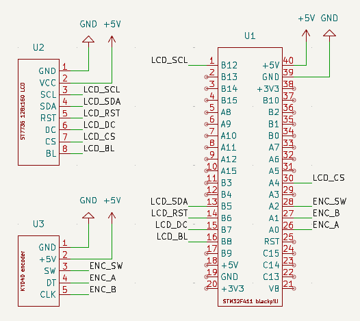
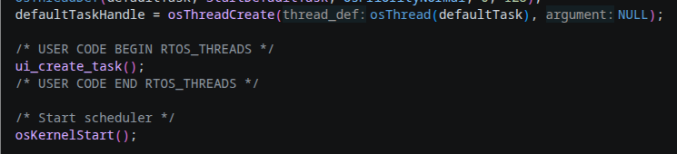

# STM32 LVGL demo

This demo shows how to use LVGL on an STM32F411 using an ST7735-based LCD display and KY040 rotary encoder.

## Hardware details

- [WeAct Studio STM32F411 blackpill development board](https://github.com/weactstudio/weactstudio.ministm32f4x1)
- [WeAct Studio 1.8" TFT LCD ST7735](https://github.com/WeActStudio/WeAct-ST7735)
- [KY040 rotary encoder](KiCad/doc/ky040.pdf)

## Development tree

The project contains two major folders:

1. [KiCad](https://www.kicad.org/) 
    Contains the wiring diagram showing how to connect the Black Pill with the ST7735 LCD and KY040 encoder: 
    

2. [VSCode](https://code.visualstudio.com/) 
    VSCode with the STM32Cube extension and STLINK debugger was chosen as the development environment. 
    The project is set up using STM32CubeMX (cf. [stm32_lvgl_demo.ioc](VSCode/stm32_lvgl_demo.ioc)).

    The application-specific code can be found in the `VSCode/Application` folder. 
    This folder contains the following implementations:
    - KY040 driver for LVGL ([ky040.h](VSCode/Application/ui/lvgl/ky040/ky040.h) and [ky040.c](VSCode/Application/ui/lvgl/ky040/ky040.c))
    - ST7735 driver for LVGL ([st7735.h](VSCode/Application/ui/lvgl/st7735/st7735.h) and [st7735.c](VSCode/Application/ui/lvgl/st7735/st7735.c))
    - Demo application ([ui_init.h](VSCode/Application/ui/ui_init.h), [ui_init.c](VSCode/Application/ui/ui_init.c), [ui_task.h](VSCode/Application/ui/ui_task.h), and [ui_task.c](VSCode/Application/ui/ui_task.c))
    
    Notes:

    - The following code shows how the application is hooked into the [main](VSCode/Core/Src/main.c#L144-L146) module of the STM32Cube framework:  
    

## Demos

1. Demo application 
   <video src="https://github.com/user-attachments/assets/f13db507-8a18-4787-9d97-3aa5b0686f59" controls="controls" width="660%"/>

2. Simple animation 
   <video src="https://github.com/user-attachments/assets/fb44fa87-dae4-414d-95d7-65df74d69eee" controls="controls" width="660%"/>
   
